# TatTester - System Architecture Component Diagram

## Overview
TatTester is a mobile-first, two-sided marketplace connecting first-time tattoo seekers with artists through AI design generation, AR visualization, and intelligent matching.

---

## Component Diagram (Mermaid)

```mermaid
graph TB
    subgraph "Client Layer"
        MobileApp[Mobile App - React Native/Flutter]
        MobileApp --> |Camera Access| ARModule[AR Preview Module]
        MobileApp --> |User Interface| UIComponents[UI Components]
        UIComponents --> DesignGallery[Design Gallery]
        UIComponents --> ArtistDiscovery[Artist Discovery - Swipe/Grid]
        UIComponents --> UserProfile[User Profile]
    end

    subgraph "API Gateway Layer"
        APIGateway[API Gateway - REST/GraphQL]
        APIGateway --> Auth[Authentication Service]
        APIGateway --> RateLimit[Rate Limiting]
    end

    subgraph "Application Services"
        DesignService[Design Generation Service]
        ARService[AR Processing Service]
        MatchingService[Artist Matching Service]
        BookingService[Booking/Contact Service]
        NotificationService[Notification Service]
        AnalyticsService[Analytics Service]
    end

    subgraph "Data Layer"
        UserDB[(User Database - PostgreSQL)]
        DesignDB[(Design Storage - S3 + Metadata)]
        ArtistDB[(Artist Profiles Database)]
        MatchingDB[(Matching Algorithm Data)]
        AnalyticsDB[(Analytics Data - TimescaleDB)]
    end

    subgraph "Third-Party Integrations"
        OpenAI[OpenAI API - GPT-4 + DALL-E 3]
        ARKit[ARKit - iOS]
        ARCore[ARCore - Android]
        Stripe[Stripe - Payments]
        Twilio[Twilio - SMS/Notifications]
        GoogleMaps[Google Maps API - Location]
        CDN[CloudFront/CDN - Image Delivery]
        EmailService[SendGrid - Email]
    end

    subgraph "Infrastructure"
        LoadBalancer[Load Balancer]
        Cache[Redis Cache]
        Queue[Job Queue - Bull/RabbitMQ]
        Monitoring[Monitoring - Datadog/Sentry]
    end

    %% Client to API Gateway
    MobileApp --> APIGateway

    %% API Gateway to Services
    APIGateway --> DesignService
    APIGateway --> ARService
    APIGateway --> MatchingService
    APIGateway --> BookingService
    APIGateway --> NotificationService

    %% Design Service Flow
    DesignService --> OpenAI
    DesignService --> DesignDB
    DesignService --> Queue

    %% AR Service Flow
    ARService --> ARKit
    ARService --> ARCore
    ARService --> DesignDB
    ARService --> Cache

    %% Matching Service Flow
    MatchingService --> ArtistDB
    MatchingService --> MatchingDB
    MatchingService --> GoogleMaps
    MatchingService --> Cache

    %% Booking Service Flow
    BookingService --> UserDB
    BookingService --> ArtistDB
    BookingService --> Stripe
    BookingService --> NotificationService

    %% Notification Service Flow
    NotificationService --> Twilio
    NotificationService --> EmailService
    NotificationService --> Queue

    %% Analytics Flow
    AnalyticsService --> AnalyticsDB
    MobileApp -.->|Events| AnalyticsService

    %% CDN Integration
    DesignDB --> CDN
    CDN --> MobileApp

    %% Infrastructure
    LoadBalancer --> APIGateway
    Cache --> DesignService
    Cache --> MatchingService
    Queue --> DesignService
    Queue --> NotificationService
    Monitoring -.->|Logs/Metrics| APIGateway
    Monitoring -.->|Logs/Metrics| DesignService
    Monitoring -.->|Logs/Metrics| MatchingService

    %% Styling
    classDef clientStyle fill:#e1f5ff,stroke:#01579b,stroke-width:2px
    classDef serviceStyle fill:#fff9c4,stroke:#f57f17,stroke-width:2px
    classDef dataStyle fill:#f3e5f5,stroke:#4a148c,stroke-width:2px
    classDef thirdPartyStyle fill:#e8f5e9,stroke:#1b5e20,stroke-width:2px
    classDef infraStyle fill:#fbe9e7,stroke:#bf360c,stroke-width:2px

    class MobileApp,ARModule,UIComponents,DesignGallery,ArtistDiscovery,UserProfile clientStyle
    class APIGateway,Auth,RateLimit,DesignService,ARService,MatchingService,BookingService,NotificationService,AnalyticsService serviceStyle
    class UserDB,DesignDB,ArtistDB,MatchingDB,AnalyticsDB dataStyle
    class OpenAI,ARKit,ARCore,Stripe,Twilio,GoogleMaps,CDN,EmailService thirdPartyStyle
    class LoadBalancer,Cache,Queue,Monitoring infraStyle
```



---

## Component Details

### 1. Client Layer (Mobile App)

**Technology Stack:**
- **Framework:** React Native (cross-platform) or Flutter
- **State Management:** Redux/MobX or Provider
- **Camera/AR:** Native modules for ARKit (iOS) and ARCore (Android)

**Key Components:**

| Component | Responsibility | Dependencies |
|-----------|---------------|--------------|
| **AR Preview Module** | Real-time tattoo overlay on camera feed | ARKit/ARCore, Camera API |
| **Design Gallery** | Save, browse, and manage generated designs | Design Service API, Local storage |
| **Artist Discovery** | Swipe/grid interface for browsing artists | Matching Service API, Location services |
| **User Profile** | Account management, preferences, saved designs | User Service API, Auth |

**Data Flows:**
- User inputs design prompt → API Gateway → Design Service → OpenAI
- Design returned → Cached locally → Displayed in Gallery
- Select design → Load in AR Module → Camera overlay rendering
- Swipe artist → Send preference data → Matching algorithm refinement

---

### 2. API Gateway Layer

**Technology:** Node.js (Express/Fastify) or Go (Gin/Echo)

**Responsibilities:**
- Route requests to appropriate microservices
- Authentication & authorization (JWT tokens)
- Rate limiting (prevent API abuse, manage OpenAI costs)
- Request validation
- API versioning

**Security Features:**
- JWT-based authentication
- OAuth 2.0 for social login (Google, Apple)
- Rate limiting: 100 requests/minute per user (adjust based on tier)
- HTTPS only, certificate pinning for mobile

---

### 3. Application Services

#### **3.1 Design Generation Service**

**Technology:** Python (FastAPI) or Node.js

**Responsibilities:**
- Process user design prompts
- Call OpenAI API (GPT-4 for prompt enhancement + DALL-E 3 for image generation)
- Apply style-specific prompt templates (traditional, fine line, geometric, etc.)
- Watermark generated images (until booking)
- Store designs with metadata

**Data Flow:**
```
User Input Prompt
  → Prompt Enhancement (GPT-4: "Make this tattoo-appropriate")
  → Style Template Application ("Generate in fine-line style...")
  → DALL-E 3 Image Generation
  → Watermark Application
  → S3 Storage + PostgreSQL Metadata
  → CDN Distribution
  → Return URL to Client
```

**Cost Management:**
- Token counting before API calls
- Cache common prompts (Redis)
- Freemium limits: 3 designs (track in user DB)
- Queue system for bulk generation (non-blocking)

**OpenAI Integration:**
```javascript
// Pseudocode
const generateDesign = async (userPrompt, style) => {
  // Step 1: Enhance prompt with GPT-4
  const enhancedPrompt = await openai.chat.completions.create({
    model: "gpt-4",
    messages: [{
      role: "system",
      content: "You are a tattoo design expert. Refine this prompt for DALL-E 3 to create a tattoo-appropriate design."
    }, {
      role: "user",
      content: `${userPrompt}. Style: ${style}`
    }]
  });

  // Step 2: Generate image with DALL-E 3
  const image = await openai.images.generate({
    model: "dall-e-3",
    prompt: enhancedPrompt.choices[0].message.content,
    size: "1024x1024",
    quality: "hd",
    n: 1
  });

  // Step 3: Store and return
  const designUrl = await storeDesign(image.data[0].url);
  return designUrl;
};
```

---

#### **3.2 AR Processing Service**

**Technology:** Native modules (Swift for iOS, Kotlin for Android) + Backend support (Node.js/Python)

**Responsibilities:**
- Provide AR SDK configuration
- Process design images for AR overlay (resize, format conversion)
- Handle multi-device compatibility
- Track AR session metrics (duration, placement adjustments)

**AR Flow:**
```
User selects design
  → Load design from CDN (cached locally)
  → Initialize ARKit/ARCore session
  → Detect body surface (hand/arm tracking)
  → Render 2D overlay (MVP) or 3D mesh wrapping (Phase 2)
  → Allow size/position adjustments
  → Screenshot save option
  → Track session duration → Analytics Service
```

**Device Compatibility:**
- iOS: ARKit 3.0+ (iPhone 6S and newer)
- Android: ARCore 1.9+ (supported devices list)
- Fallback: 2D static overlay for unsupported devices

**Performance Targets:**
- <100ms latency for real-time tracking
- 30 FPS minimum for smooth overlay
- ±2cm placement accuracy

---

#### **3.3 Artist Matching Service**

**Technology:** Python (scikit-learn/TensorFlow for ML) or Node.js

**Responsibilities:**
- Match users to artists based on design style, location, availability, price
- Rank artists using scoring algorithm
- Learn from user swipe behavior (collaborative filtering)
- Handle geographic filtering

**Matching Algorithm:**
```python
# Pseudocode scoring algorithm
def calculate_artist_score(user_design, artist_profile, user_location):
    score = 0

    # Style match (40% weight) - Most important
    style_similarity = cosine_similarity(
        design_style_vector(user_design),
        artist_specialties_vector(artist_profile)
    )
    score += style_similarity * 0.4

    # Location proximity (25% weight)
    distance_km = calculate_distance(user_location, artist_profile.location)
    location_score = max(0, 1 - (distance_km / 50))  # 50km radius
    score += location_score * 0.25

    # Availability (15% weight)
    availability_score = 1 if artist_profile.availability < 30 else 0.5
    score += availability_score * 0.15

    # Reviews/Rating (15% weight)
    rating_score = artist_profile.rating / 5.0
    score += rating_score * 0.15

    # Price match (5% weight)
    price_match = 1 if artist_profile.price_range in user_preferences.price_range else 0.5
    score += price_match * 0.05

    return score

# Return top 20 artists sorted by score
```

**Data Flows:**
- User generates design → Extract style features (ML model)
- Query artist DB → Filter by location radius
- Score each artist → Sort by score
- Return top 20 → Client displays in swipe/grid
- User swipes → Record preference → Refine future matches

**Integrations:**
- Google Maps API: Distance calculation, geocoding
- Redis Cache: Store pre-computed matches for common styles/locations

---

#### **3.4 Booking/Contact Service**

**Technology:** Node.js (Express) or Python (FastAPI)

**Responsibilities:**
- Handle user-to-artist contact requests
- Process booking deposits (via Stripe)
- Store booking metadata
- Trigger notifications

**Booking Flow:**
```
User clicks "Contact Artist"
  → Create booking request record (pending status)
  → Notify artist via email + SMS (Twilio)
  → Artist responds (accept/decline/request more info)
  → If accepted: Initiate deposit payment (Stripe)
  → On payment success: Confirm booking → Update status
  → Send confirmation to both parties
```

**MVP Scope (Phase 1):**
- Simple contact form (not full booking)
- Email/SMS notification to artist
- Track contact → booking conversion rate

**Phase 2 (Post-Funding):**
- Calendar integration (check artist availability)
- Deposit payments (Stripe integration)
- Booking management dashboard for artists

---

#### **3.5 Notification Service**

**Technology:** Node.js with Bull Queue (job queue)

**Responsibilities:**
- Send transactional emails (SendGrid)
- Send SMS notifications (Twilio)
- Send push notifications (Firebase Cloud Messaging)
- Queue and batch notifications to reduce costs

**Notification Types:**

| Event | Channel | Priority |
|-------|---------|----------|
| Design generated | Push | High |
| Artist match found | Push + Email | Medium |
| Artist responds to contact | Push + SMS | High |
| Booking confirmed | Email + SMS | High |
| Reminder (24h before appointment) | Push + SMS | High |

**Cost Optimization:**
- Use free tier of SendGrid (100 emails/day) initially
- SMS only for critical notifications (booking confirmations)
- Push notifications are free (Firebase)

---

#### **3.6 Analytics Service**

**Technology:** Node.js + TimescaleDB (time-series PostgreSQL extension)

**Responsibilities:**
- Track user behavior events
- Funnel analysis (design → AR → artist contact → booking)
- A/B testing data
- Artist performance metrics

**Key Metrics Tracked:**

| Metric | Event | Purpose |
|--------|-------|---------|
| Design Generation Rate | `design_generated` | Monitor API costs, freemium conversion |
| Design → AR Preview Rate | `ar_session_started` | Measure design quality satisfaction |
| AR Session Duration | `ar_session_ended` | Identify booking intent (>2 min = high intent) |
| Artist Contact Rate | `artist_contacted` | Core PMF metric (target >30%) |
| Booking Conversion | `booking_confirmed` | Revenue metric |
| Free → Paid Conversion | `subscription_started` | Monetization efficiency |

**Integration:**
- Mobile SDK: Mixpanel or Amplitude (easier for startups)
- Custom backend: TimescaleDB for cost-effective time-series storage
- Dashboards: Metabase or Redash (open-source BI tools)

---

### 4. Data Layer

#### **4.1 User Database (PostgreSQL)**

**Schema:**

```sql
-- Users table
CREATE TABLE users (
    user_id UUID PRIMARY KEY,
    email VARCHAR(255) UNIQUE NOT NULL,
    password_hash VARCHAR(255), -- null if OAuth
    auth_provider VARCHAR(50), -- 'email', 'google', 'apple'
    subscription_tier VARCHAR(20) DEFAULT 'free', -- 'free', 'premium'
    subscription_expires_at TIMESTAMP,
    created_at TIMESTAMP DEFAULT NOW(),
    updated_at TIMESTAMP DEFAULT NOW()
);

-- User preferences
CREATE TABLE user_preferences (
    user_id UUID PRIMARY KEY REFERENCES users(user_id),
    preferred_styles JSON, -- ['fine-line', 'geometric']
    price_range JSON, -- {min: 200, max: 500}
    location_lat DECIMAL(9,6),
    location_lng DECIMAL(9,6),
    max_distance_km INT DEFAULT 50
);

-- Usage tracking (for freemium limits)
CREATE TABLE user_usage (
    user_id UUID REFERENCES users(user_id),
    period_start DATE,
    designs_generated INT DEFAULT 0,
    ar_sessions_count INT DEFAULT 0,
    PRIMARY KEY (user_id, period_start)
);
```

---

#### **4.2 Design Storage (S3 + PostgreSQL Metadata)**

**S3 Bucket Structure:**
```
tattester-designs/
  └── users/
      └── {user_id}/
          └── {design_id}.png
          └── {design_id}_watermarked.png
          └── {design_id}_thumbnail.png
```

**PostgreSQL Metadata:**
```sql
CREATE TABLE designs (
    design_id UUID PRIMARY KEY,
    user_id UUID REFERENCES users(user_id),
    prompt TEXT,
    enhanced_prompt TEXT, -- GPT-4 enhanced version
    style VARCHAR(50), -- 'fine-line', 'traditional', etc.
    image_url VARCHAR(500), -- S3 URL via CloudFront
    thumbnail_url VARCHAR(500),
    watermarked BOOLEAN DEFAULT TRUE,
    openai_cost DECIMAL(10,4), -- track API costs
    user_rating INT, -- 1-5 stars (quality feedback)
    created_at TIMESTAMP DEFAULT NOW()
);

CREATE INDEX idx_designs_user_id ON designs(user_id);
CREATE INDEX idx_designs_style ON designs(style);
```

---

#### **4.3 Artist Profiles Database**

**Schema:**
```sql
CREATE TABLE artists (
    artist_id UUID PRIMARY KEY,
    email VARCHAR(255) UNIQUE NOT NULL,
    shop_name VARCHAR(255),
    bio TEXT,
    location_lat DECIMAL(9,6),
    location_lng DECIMAL(9,6),
    address TEXT,
    phone VARCHAR(20),
    instagram_handle VARCHAR(100),
    portfolio_images JSON, -- Array of S3 URLs
    specialties JSON, -- ['fine-line', 'geometric', 'traditional']
    price_range JSON, -- {min: 100, max: 500}
    availability_days INT, -- days until next opening
    rating DECIMAL(3,2), -- 0-5.00
    review_count INT,
    subscription_tier VARCHAR(20) DEFAULT 'free', -- 'free', 'premium'
    commission_rate DECIMAL(4,2) DEFAULT 10.00, -- percentage
    created_at TIMESTAMP DEFAULT NOW()
);

CREATE INDEX idx_artists_location ON artists USING GIST(
    ll_to_earth(location_lat, location_lng)
); -- geospatial index

-- Artist-user interactions
CREATE TABLE artist_interactions (
    interaction_id UUID PRIMARY KEY,
    user_id UUID REFERENCES users(user_id),
    artist_id UUID REFERENCES artists(artist_id),
    design_id UUID REFERENCES designs(design_id),
    action VARCHAR(20), -- 'swipe_right', 'swipe_left', 'contacted', 'booked'
    created_at TIMESTAMP DEFAULT NOW()
);
```

---

#### **4.4 Matching Algorithm Data (Redis + PostgreSQL)**

**Redis Cache:**
```
# Pre-computed match scores (expire after 1 hour)
Key: match:{user_id}:{style}:{location}
Value: [artist_id_1, artist_id_2, ...] (sorted by score)

# Artist style vectors (ML embeddings)
Key: artist_vector:{artist_id}
Value: [0.23, 0.45, 0.12, ...] (style embedding)
```

**PostgreSQL (for persistence):**
```sql
CREATE TABLE match_history (
    user_id UUID REFERENCES users(user_id),
    artist_id UUID REFERENCES artists(artist_id),
    design_id UUID REFERENCES designs(design_id),
    score DECIMAL(5,4), -- 0-1.0000
    matched_at TIMESTAMP DEFAULT NOW(),
    PRIMARY KEY (user_id, artist_id, design_id)
);
```

---

#### **4.5 Analytics Data (TimescaleDB)**

**Hypertable for time-series events:**
```sql
CREATE TABLE events (
    event_id UUID,
    user_id UUID,
    event_type VARCHAR(50), -- 'design_generated', 'ar_session_started', etc.
    event_data JSON, -- flexible metadata
    timestamp TIMESTAMPTZ NOT NULL
);

-- Convert to hypertable (TimescaleDB)
SELECT create_hypertable('events', 'timestamp');

CREATE INDEX idx_events_user_id ON events(user_id, timestamp DESC);
CREATE INDEX idx_events_type ON events(event_type, timestamp DESC);
```

---

### 5. Third-Party Integrations

#### **5.1 OpenAI API**

**Services Used:**
- **GPT-4:** Prompt enhancement, conversational design refinement
- **DALL-E 3:** Image generation

**Cost Estimates (per design):**
- GPT-4 prompt enhancement: ~500 tokens = $0.015
- DALL-E 3 HD image (1024x1024): $0.080
- **Total per design: ~$0.10**

**Budget Management:**
- Freemium users: 3 designs = $0.30 per user
- Premium users: Unlimited (monitor avg usage, ~10 designs/month = $1.00)
- Monthly budget (1,000 free users, 100 premium): $430/month

**Rate Limiting:**
- OpenAI tier limits: 10,000 requests/minute (plenty for MVP)
- Internal limits: 5 designs/hour for free users, 20/hour for premium

---

#### **5.2 ARKit (iOS) & ARCore (Android)**

**ARKit (Apple):**
- Free SDK, no API costs
- Requires iOS 11+ (ARKit 3.0+ for body tracking)
- Features: Plane detection, image tracking, body pose estimation

**ARCore (Google):**
- Free SDK, no API costs
- Requires Android 7.0+ with ARCore support
- Features: Motion tracking, environmental understanding

**Implementation:**
- Native modules in React Native (react-native-arkit, react-native-arcore)
- Or use unified SDK like 8th Wall (paid, $99/month) for easier cross-platform

**MVP Approach:**
- Use free native SDKs (steeper learning curve but $0 cost)
- 2D image overlay (simpler than 3D mesh wrapping)
- Phase 2: 3D body mesh wrapping for curved surfaces

---

#### **5.3 Stripe (Payments)**

**Use Cases:**
- Premium subscription billing ($9.99/month)
- Booking deposits (Phase 2: $50-200 per booking)
- Artist payouts (Phase 2: marketplace escrow)

**Cost:**
- 2.9% + $0.30 per transaction
- Subscription: $9.99 × 2.9% = $0.29 + $0.30 = $0.59 per charge
- **Net revenue per subscription: $9.40/month**

**Integration:**
- Stripe Elements for web checkout
- Stripe SDK for mobile (in-app purchases alternative)
- Webhooks for subscription status updates

---

#### **5.4 Twilio (SMS Notifications)**

**Use Cases:**
- Artist booking notifications (high priority)
- User booking confirmations
- Appointment reminders (24h before)

**Cost:**
- $0.0079 per SMS (US)
- Estimated usage: 500 SMS/month (MVP) = $4/month

**Optimization:**
- Use SMS only for critical notifications (booking/confirmation)
- Email + push for non-urgent updates

---

#### **5.5 Google Maps API**

**Services Used:**
- **Geocoding API:** Convert addresses to lat/lng
- **Distance Matrix API:** Calculate artist-user distances
- **Maps SDK:** Display artists on map (Phase 2)

**Cost:**
- Geocoding: $5 per 1,000 requests
- Distance Matrix: $5 per 1,000 elements
- Estimated usage (1,000 users/month): $50/month

**Optimization:**
- Cache geocoded addresses (artists don't move)
- Batch distance calculations
- Use Haversine formula for approximate distance (free) before precise API call

---

#### **5.6 CloudFront (CDN)**

**Purpose:**
- Fast image delivery globally
- Reduce S3 egress costs
- Cache generated designs

**Cost:**
- First 1 TB: $0.085/GB
- Estimated usage (10,000 designs/month, 1MB each): 10 GB = $0.85/month

---

#### **5.7 SendGrid (Email)**

**Use Cases:**
- Welcome emails
- Design ready notifications
- Artist match alerts
- Booking confirmations

**Cost:**
- Free tier: 100 emails/day (3,000/month)
- Paid: $19.95/month for 40,000 emails

**MVP Strategy:** Use free tier, upgrade if needed

---

### 6. Infrastructure

#### **6.1 Hosting & Compute**

**Option 1: AWS (Recommended for scalability)**
- **EC2 / ECS:** Backend services (t3.medium = $30/month)
- **RDS PostgreSQL:** Database (db.t3.micro = $15/month)
- **ElastiCache Redis:** Caching (cache.t3.micro = $12/month)
- **S3:** Design storage (10 GB = $0.23/month)
- **Total AWS estimate (MVP): ~$100/month**

**Option 2: Render/Railway (Bootstrap-friendly)**
- Easier deployment, managed services
- Cost: ~$50-80/month for MVP
- Trade-off: Less control, harder to scale later

---

#### **6.2 Monitoring & Logging**

**Sentry (Error Tracking):**
- Free tier: 5,000 errors/month
- Tracks crashes, exceptions, performance issues

**Datadog / Grafana (Metrics):**
- Datadog: $15/host/month (use free tier initially)
- Or self-hosted Grafana (free, more setup)

**Logging:**
- CloudWatch (AWS) or self-hosted ELK stack
- Track API latency, OpenAI costs, error rates

---

#### **6.3 Job Queue (Background Processing)**

**Bull (Redis-backed queue for Node.js):**
- Use for async tasks:
  - Design generation (avoid blocking API requests)
  - Notification sending
  - Analytics event processing
  - Batch artist matching

**Example:**
```javascript
// Add design generation to queue
await designQueue.add('generate', {
  userId: user.id,
  prompt: 'dragon with flowers',
  style: 'fine-line'
}, {
  attempts: 3,
  backoff: 5000
});

// Worker processes job
designQueue.process('generate', async (job) => {
  const design = await generateDesignWithOpenAI(job.data);
  await storeDesign(design);
  await notifyUser(job.data.userId, design.id);
});
```

---

## Data Flow Examples

### **Flow 1: User Generates Design**

```
1. User enters prompt in Mobile App: "Small dragon with cherry blossoms"
2. App sends POST /api/designs/generate
   └─> API Gateway authenticates JWT
   └─> Checks freemium limits (user_usage table)
   └─> Routes to Design Service

3. Design Service:
   └─> Adds job to queue (Bull)
   └─> Returns 202 Accepted with job_id

4. Background Worker:
   └─> Enhances prompt with GPT-4
       "A delicate fine-line tattoo design of a small dragon
        intertwined with cherry blossoms, black and grey,
        suitable for wrist placement"
   └─> Calls DALL-E 3 to generate image
   └─> Downloads image, adds watermark
   └─> Uploads to S3
   └─> Saves metadata to PostgreSQL (designs table)
   └─> Invalidates cache
   └─> Sends push notification to user

5. User receives notification, opens app
   └─> App fetches design from CDN
   └─> Displays in gallery
   └─> User can now preview in AR or refine
```

**Latency:** 20-40 seconds (async, non-blocking)

---

### **Flow 2: User Previews Design in AR**

```
1. User selects design from gallery, taps "Preview in AR"
2. App requests camera permission
3. App initializes ARKit/ARCore session
4. App downloads design image (cached from CDN)
5. ARKit/ARCore detects body surface (arm/hand tracking)
6. App overlays design on camera feed
   └─> User adjusts size/position with touch gestures
7. User spends 3 minutes in AR (indicates high confidence)
8. User taps "Save Screenshot"
   └─> App saves photo to camera roll
   └─> App sends analytics event: ar_session_ended
       {duration: 180, adjustments: 5, screenshot_saved: true}

9. Analytics Service records event
   └─> User is flagged as "high booking intent" (duration >2 min)
   └─> Triggers artist matching if not already done
```

**Latency:** Real-time (<100ms tracking)

---

### **Flow 3: User Discovers & Contacts Artist**

```
1. After AR preview, user taps "Find Artists"
2. App sends GET /api/artists/match?design_id=xxx
   └─> API Gateway routes to Matching Service

3. Matching Service:
   └─> Checks Redis cache for pre-computed matches
   └─> If cache miss:
       - Extract style from design metadata
       - Get user location
       - Query artist DB with geospatial filter (50km radius)
       - Score each artist (style + location + rating + availability)
       - Sort by score, return top 20
       - Cache results in Redis (expire 1 hour)

4. App receives artist list, displays in swipe interface
5. User swipes right on 3 artists (sends preferences to backend)
   └─> Matching Service records swipe (artist_interactions table)

6. User taps "Contact" on favorite artist
7. App sends POST /api/bookings/contact
   └─> Booking Service creates booking_request record
   └─> Triggers Notification Service

8. Notification Service:
   └─> Sends email to artist (SendGrid)
   └─> Sends SMS to artist (Twilio) - "New tattoo inquiry from TatTester"
   └─> Sends push notification to user: "Your message was sent!"

9. Artist receives notification, opens email
   └─> Clicks link to view user's design + message
   └─> Responds via TatTester platform or direct contact
```

**Latency:** <2 seconds for matching, <5 seconds for contact request

---

## Scalability Considerations

### **Current MVP Architecture (0-10K users):**
- Single API server (can handle ~1,000 req/s)
- RDS PostgreSQL (db.t3.small can handle 10K users)
- Redis for caching
- S3 + CloudFront for images
- **Cost: ~$150-200/month**

### **Growth Stage (10K-100K users):**
- Horizontal scaling: Load balancer + multiple API servers
- Read replicas for PostgreSQL
- Separate microservices (design, matching, booking)
- ElastiCache Redis cluster
- **Cost: ~$800-1,500/month**

### **Scale Stage (100K+ users):**
- Kubernetes for container orchestration
- Separate databases per service (microservices architecture)
- CDN edge caching
- Multi-region deployment
- **Cost: $5,000-10,000/month**

---

## Security Architecture

### **Authentication Flow:**
```
1. User signs up with email/password or OAuth (Google/Apple)
2. Backend generates JWT token (expires 7 days)
3. Mobile app stores token in secure storage (Keychain/KeyStore)
4. Every API request includes: Authorization: Bearer <token>
5. API Gateway validates token, extracts user_id
6. Refresh token mechanism for seamless re-auth
```

### **Data Security:**
- **Encryption at rest:** S3 encryption, RDS encryption
- **Encryption in transit:** HTTPS/TLS 1.3 only
- **Secrets management:** AWS Secrets Manager or environment variables
- **API keys:** Never exposed to client (all calls via backend)
- **Rate limiting:** Prevent abuse, manage OpenAI costs

### **Privacy:**
- User designs are private by default (not publicly searchable)
- Watermarks prevent unauthorized use
- Artists only see designs when user initiates contact
- GDPR compliance: Right to delete (cascade delete user data)

---

## Cost Breakdown (Monthly - MVP with 1,000 Users)

| Component | Cost |
|-----------|------|
| **Infrastructure** | |
| AWS EC2/ECS (backend) | $30 |
| RDS PostgreSQL | $15 |
| ElastiCache Redis | $12 |
| S3 Storage (10 GB) | $0.23 |
| CloudFront CDN | $0.85 |
| **Third-Party APIs** | |
| OpenAI (300 free users × 3 designs + 100 premium × 10) | $190 |
| Stripe fees (100 premium × $9.99) | $59 |
| Google Maps API | $20 |
| SendGrid (free tier) | $0 |
| Twilio SMS (500/month) | $4 |
| **Monitoring** | |
| Sentry (free tier) | $0 |
| Datadog (1 host, or use free tier) | $0 |
| **Total** | **~$331/month** |

**Revenue (1,000 users, 100 premium):**
- Premium subscriptions: 100 × $9.99 = $999/month
- **Gross margin: $668/month (67%)**

At **10,000 users (1,000 premium):**
- Revenue: $9,990/month
- Costs: ~$1,200/month (OpenAI scales with usage)
- **Gross margin: $8,790/month (88%)**

---

## Technology Stack Recommendations

### **Mobile App**
- **Framework:** React Native (faster development, one codebase)
- **Alternative:** Flutter (better performance, but smaller community)
- **State Management:** Redux Toolkit or Zustand
- **AR:** Native modules (react-native-arkit, react-native-arcore)

### **Backend**
- **API:** Node.js (Express/Fastify) - fast development, good for real-time
- **Alternative:** Python (FastAPI) - better for ML matching algorithm
- **Database:** PostgreSQL (relational data + PostGIS for geospatial)
- **Cache:** Redis (sessions, match results, rate limiting)
- **Queue:** Bull (Redis-backed, easy Node.js integration)

### **DevOps**
- **Hosting:** AWS (best for scaling long-term)
- **CI/CD:** GitHub Actions (free for open-source/small teams)
- **Deployment:** Docker + ECS or Kubernetes (later stage)
- **Monitoring:** Sentry (errors) + Datadog or Grafana (metrics)

---

## Next Steps: MVP Implementation

### **Phase 1: Core Backend (Weeks 1-3)**
1. Set up API Gateway with authentication
2. Implement Design Generation Service (OpenAI integration)
3. Set up PostgreSQL schemas (users, designs, artists)
4. Implement basic analytics tracking

### **Phase 2: Mobile App (Weeks 4-7)**
1. Build UI components (design gallery, artist discovery)
2. Integrate AR preview (ARKit/ARCore native modules)
3. Connect to backend APIs
4. Implement local caching

### **Phase 3: Matching & Booking (Weeks 8-10)**
1. Build Artist Matching Service
2. Implement swipe/grid discovery UI
3. Build contact/booking flow
4. Set up notification service (SendGrid + Twilio)

### **Phase 4: Testing & Launch (Weeks 11-12)**
1. Beta testing with 20 users, 5 artists
2. Fix bugs, optimize performance
3. Soft launch in Austin

---

**This architecture is designed for:**
- ✅ Bootstrap budget (<$500/month infrastructure)
- ✅ Fast MVP development (10-12 weeks)
- ✅ Scalability to 100K+ users
- ✅ Cost-efficient operations (focus on OpenAI spend management)
- ✅ Flexibility to pivot based on user feedback

For implementation guidance, consult the tattester-code-agent for specific coding tasks!
