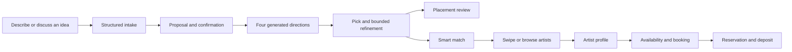
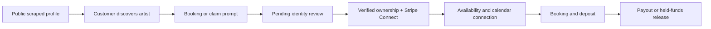

# Customer journeys

## Consumer: design to artist

### Built route reality

The launch routes now implement the convergence decisions:

- `/design`: the only consumer design entry, with conversation and fast lane.
- `/generate/stencil`: compatibility redirect to `/design` that preserves the
  prompt.
- `/studio`: the Studio — the refinery (ADR-0038), entered from a picked design
  as `/studio?design=<id>`.
- `/generate`: compatibility redirect to `/studio` that forwards every param.
- `/journey`: removed.
- `/smart-match` and `/swipe`: design-aware match chain.
- `/matches`: compatibility redirect to `/artists` with filter mapping.
- `/artists`: browse/compare directory.
- `/console`: signed-in artist home for bookings, availability, and payouts.

`docs/SITE_MAP.md` records the implemented route-by-route launch verdicts.

## Consumer: placement

TatT has two honest placement experiences:

- A photo-composite preview that places a transparent design onto an uploaded
  body photograph.
- A live-camera overlay that the user positions manually.

Neither experience performs anatomical body tracking, depth estimation,
perspective correction, or measurement-grade placement accuracy. ADR-0024
explicitly removed fabricated claims and unreachable MindAR code.

## Consumer: sharing and saved work

Selected designs can be saved locally or through the current storage adapters,
opened from the design library, and shared through addressable share links.
Shared links are a product surface and must use the same brand and claim rules
as the main journey.

## Artist: discovery to payout readiness

Most profiles are not claimed. A public request changes no ownership or payout
state; an operator verifies the Instagram code or documents the manual fallback
before the profile becomes editable or payable. Identity assurance, onboarding,
and payout readiness are therefore part of the booking product, not separate
administrative concerns.

## Artist: removal and return

An artist can request removal without first creating an account. Suppression
must affect public discovery, matching, and hosted portfolio display. A
separate reinstatement path allows a removed artist to request return without
publicly disclosing why the profile is absent.

## Evidence

- Design orchestration: `src/services/designSession/index.ts`,
  `src/features/design-session/__tests__/DesignSessionFlow.test.tsx`
- Route convergence: `src/app/design/page.tsx`,
  `src/app/generate/stencil/page.tsx`, `src/app/generate/page.tsx`,
  `src/app/generate/stencil/page.test.tsx`, `src/app/smart-match/page.tsx`,
  `src/app/swipe/page.tsx`, `src/app/matches/page.tsx`
- Placement: `src/features/design-session/components/PlacementPreview.tsx`,
  `src/features/design-session/__tests__/PlacementPreview.test.tsx`,
  `src/services/ar/__tests__/arService.test.js`
- Sharing: `src/app/api/v1/designs/share/__tests__/route.test.ts`,
  `src/app/share/[shareId]/page.test.tsx`
- Booking holds and relay: `src/lib/booking-holds.test.ts`,
  `src/lib/booking-relay.test.ts`,
  `src/lib/booking-relay.transfers.test.ts`
- Artist claims and Connect: `src/app/api/v1/connect/claim/route.test.ts`,
  `src/app/api/v1/connect/claim-complete/route.test.ts`,
  `scripts/lib/claim-approval-plan.test.mjs`
- Artist-managed profile: `src/app/api/v1/artist/profile/route.test.ts`,
  `src/lib/artist-profile.test.ts`
- Takedown suppression: `src/lib/takedown.test.ts`,
  `src/app/api/v1/artists/takedown/route.test.ts`
- Reinstatement: `src/lib/reinstatement.test.ts`,
  `src/app/api/v1/artists/reinstate/route.test.ts`
