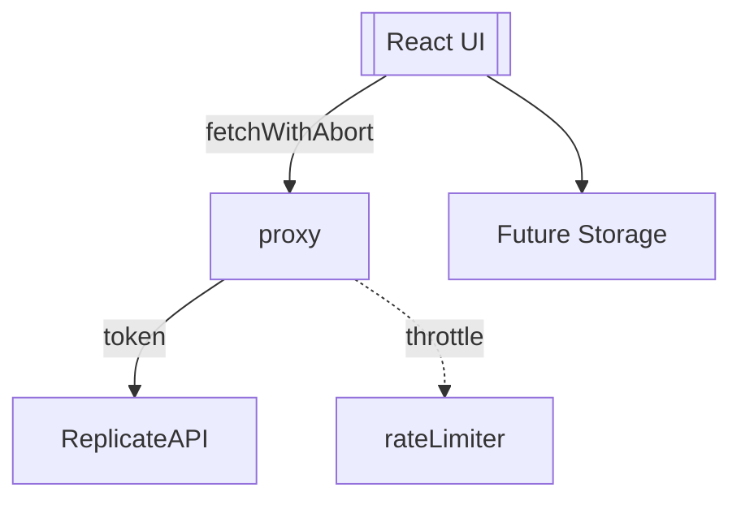

# TatT Production Hardening Roadmap

## Phase 1 – Security & API Hardening (P0)

1. Lock down proxy

• Edit [server.js](server.js) – restrict CORS to env-driven whitelist, add Bearer auth middleware, express-rate-limit throttle, bind 127.0.0.1 unless HOST env provided.• Remove all `VITE_REPLICATE_API_TOKEN` references; load token with `process.env.REPLICATE_API_TOKEN` only.

2. Stabilise API layer

• Refactor [src/services/replicateService.js](src/services/replicateService.js) – replace hard-coded `http://localhost:3001/api` with env `import.meta.env.VITE_PROXY_URL` fallback.• Implement `src/services/fetchWithAbort.js` – shared wrapper (AbortController, typed error object).

3. Client security cleanup

• Purge token exposure from Vite envs, update build scripts & vercel.json.

### Phase 1 Deliverable

Proxy requires `Authorization: Bearer <frontend-token>`; client handles auth errors gracefully via typed surfaces.

## Phase 2 – Architecture Refactor & Data Hygiene

1. Decompose `DesignGenerator`

• Move form logic to `DesignForm.jsx`, results to `ResultsGrid.jsx`, stencil controls to `StencilPanel.jsx`, modal logic to `GeneratorModals.jsx`.• Convert polling/intervals to `useEffect` + cleanup.

2. Storage migration prep

• Refactor [designLibraryService.js](src/services/designLibraryService.js) & [imageProcessingService.js](src/services/imageProcessingService.js) to stop writing base64 blobs to `localStorage` – store urls/ids only.• Draft schema & helper in `src/services/storageService.js` anticipating Supabase/Convex.

## Phase 3 – UX / UI Polish & Reliability

1. Theming & feedback

• Tokenised palette in [tailwind.config.js](tailwind.config.js).• Replace `alert()` with non-blocking toasts via shadcn/ui primitives.

2. Navigation & motion

• Fix active route logic in [src/App.jsx](src/App.jsx) (use `useLocation` pathname startsWith).• Add focus/hover states, skeleton loaders, framer-motion page transitions.

3. Tests & budgets

• Integration tests for proxy (auth happy / fail) using `supertest`.• Component tests for generator state transitions with `@testing-library/react`.• Budget monitor cron in proxy to warn on credit burn.

